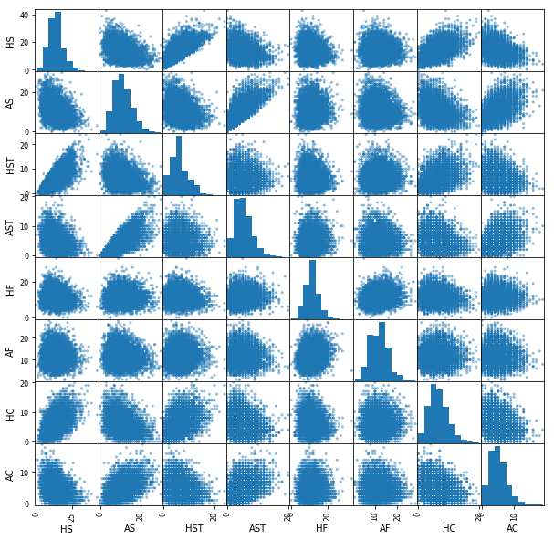

```python
import pandas as pd
import numpy as np
import matplotlib.pyplot as plt
```


```python
game_data = pd.read_csv('dataset_final.csv')
#game_data = game_data[['FTHG','FTAG','FTR','HTHG','HTAG','HTR','HS','AS','HST','AST','HF','AF','HC','AC','HY','AY','HR','AR','HomeTeam', 'AwayTeam','Referee']]
game_data.head()
```


<div>
<style scoped>
    .dataframe tbody tr th:only-of-type {
        vertical-align: middle;
    }

    .dataframe tbody tr th {
        vertical-align: top;
    }

    .dataframe thead th {
        text-align: right;
    }
</style>
<table border="1" class="dataframe">
  <thead>
    <tr style="text-align: right;">
      <th></th>
      <th>Div</th>
      <th>HomeTeam</th>
      <th>AwayTeam</th>
      <th>FTHG</th>
      <th>FTAG</th>
      <th>FTR</th>
      <th>HTHG</th>
      <th>HTAG</th>
      <th>HTR</th>
      <th>Referee</th>
      <th>...</th>
      <th>HST</th>
      <th>AST</th>
      <th>HF</th>
      <th>AF</th>
      <th>HC</th>
      <th>AC</th>
      <th>HY</th>
      <th>AY</th>
      <th>HR</th>
      <th>AR</th>
    </tr>
  </thead>
  <tbody>
    <tr>
      <th>0</th>
      <td>E0</td>
      <td>Fulham</td>
      <td>Arsenal</td>
      <td>0</td>
      <td>3</td>
      <td>A</td>
      <td>0</td>
      <td>1</td>
      <td>A</td>
      <td>C Kavanagh</td>
      <td>...</td>
      <td>2</td>
      <td>6</td>
      <td>12</td>
      <td>12</td>
      <td>2</td>
      <td>3</td>
      <td>2</td>
      <td>2</td>
      <td>0</td>
      <td>0</td>
    </tr>
    <tr>
      <th>1</th>
      <td>E0</td>
      <td>Crystal Palace</td>
      <td>Southampton</td>
      <td>1</td>
      <td>0</td>
      <td>H</td>
      <td>1</td>
      <td>0</td>
      <td>H</td>
      <td>Jj Moss</td>
      <td>...</td>
      <td>3</td>
      <td>5</td>
      <td>14</td>
      <td>11</td>
      <td>7</td>
      <td>3</td>
      <td>2</td>
      <td>1</td>
      <td>0</td>
      <td>0</td>
    </tr>
    <tr>
      <th>2</th>
      <td>E0</td>
      <td>Liverpool</td>
      <td>Leeds</td>
      <td>4</td>
      <td>3</td>
      <td>H</td>
      <td>3</td>
      <td>2</td>
      <td>H</td>
      <td>M Oliver</td>
      <td>...</td>
      <td>6</td>
      <td>3</td>
      <td>9</td>
      <td>6</td>
      <td>9</td>
      <td>0</td>
      <td>1</td>
      <td>0</td>
      <td>0</td>
      <td>0</td>
    </tr>
    <tr>
      <th>3</th>
      <td>E0</td>
      <td>West Ham</td>
      <td>Newcastle</td>
      <td>0</td>
      <td>2</td>
      <td>A</td>
      <td>0</td>
      <td>0</td>
      <td>D</td>
      <td>S Attwell</td>
      <td>...</td>
      <td>3</td>
      <td>2</td>
      <td>13</td>
      <td>7</td>
      <td>8</td>
      <td>7</td>
      <td>2</td>
      <td>2</td>
      <td>0</td>
      <td>0</td>
    </tr>
    <tr>
      <th>4</th>
      <td>E0</td>
      <td>West Brom</td>
      <td>Leicester</td>
      <td>0</td>
      <td>3</td>
      <td>A</td>
      <td>0</td>
      <td>0</td>
      <td>D</td>
      <td>A Taylor</td>
      <td>...</td>
      <td>1</td>
      <td>7</td>
      <td>12</td>
      <td>9</td>
      <td>2</td>
      <td>5</td>
      <td>1</td>
      <td>1</td>
      <td>0</td>
      <td>0</td>
    </tr>
  </tbody>
</table>
<p>5 rows × 22 columns</p>
</div>


```python
game_data.shape
```


    (7025, 22)


```python
game_data.size
```


    154550


```python
game_data.count()
```


    Div         7025
    HomeTeam    7025
    AwayTeam    7025
    FTHG        7025
    FTAG        7025
    FTR         7025
    HTHG        7025
    HTAG        7025
    HTR         7025
    Referee     7025
    HS          7025
    AS          7025
    HST         7025
    AST         7025
    HF          7025
    AF          7025
    HC          7025
    AC          7025
    HY          7025
    AY          7025
    HR          7025
    AR          7025
    dtype: int64


```python
game_data['FTR'].value_counts()
```


    H    3251
    A    2019
    D    1755
    Name: FTR, dtype: int64


```python
# Visualising distribution of data
from pandas.plotting import scatter_matrix
scatter_matrix(game_data[['HS','AS','HST','AST','HF', 'AF', 'HC','AC']], figsize=(10,10))
```


    array([[<matplotlib.axes._subplots.AxesSubplot object at 0x000002B9170DA9E8>,
            <matplotlib.axes._subplots.AxesSubplot object at 0x000002B916F1CB70>,
            <matplotlib.axes._subplots.AxesSubplot object at 0x000002B916F0DDD8>,
            <matplotlib.axes._subplots.AxesSubplot object at 0x000002B916EF6080>,
            <matplotlib.axes._subplots.AxesSubplot object at 0x000002B916E082E8>,
            <matplotlib.axes._subplots.AxesSubplot object at 0x000002B916E2B780>,
            <matplotlib.axes._subplots.AxesSubplot object at 0x000002B916E52C18>,
            <matplotlib.axes._subplots.AxesSubplot object at 0x000002B916E83208>],
           [<matplotlib.axes._subplots.AxesSubplot object at 0x000002B916E83240>,
            <matplotlib.axes._subplots.AxesSubplot object at 0x000002B916ED1CC0>,
            <matplotlib.axes._subplots.AxesSubplot object at 0x000002B916F3F278>,
            <matplotlib.axes._subplots.AxesSubplot object at 0x000002B916F667F0>,
            <matplotlib.axes._subplots.AxesSubplot object at 0x000002B916F90D68>,
            <matplotlib.axes._subplots.AxesSubplot object at 0x000002B916FBF320>,
            <matplotlib.axes._subplots.AxesSubplot object at 0x000002B916FE6898>,
            <matplotlib.axes._subplots.AxesSubplot object at 0x000002B917581E10>],
           [<matplotlib.axes._subplots.AxesSubplot object at 0x000002B9175B03C8>,
            <matplotlib.axes._subplots.AxesSubplot object at 0x000002B9175D7940>,
            <matplotlib.axes._subplots.AxesSubplot object at 0x000002B9175FFEB8>,
            <matplotlib.axes._subplots.AxesSubplot object at 0x000002B91762E470>,
            <matplotlib.axes._subplots.AxesSubplot object at 0x000002B9176559E8>,
            <matplotlib.axes._subplots.AxesSubplot object at 0x000002B91767DF60>,
            <matplotlib.axes._subplots.AxesSubplot object at 0x000002B9176AD518>,
            <matplotlib.axes._subplots.AxesSubplot object at 0x000002B9176D5A90>],
           [<matplotlib.axes._subplots.AxesSubplot object at 0x000002B917705048>,
            <matplotlib.axes._subplots.AxesSubplot object at 0x000002B91772C5C0>,
            <matplotlib.axes._subplots.AxesSubplot object at 0x000002B917753B38>,
            <matplotlib.axes._subplots.AxesSubplot object at 0x000002B9177850F0>,
            <matplotlib.axes._subplots.AxesSubplot object at 0x000002B9177AE668>,
            <matplotlib.axes._subplots.AxesSubplot object at 0x000002B9177D4BE0>,
            <matplotlib.axes._subplots.AxesSubplot object at 0x000002B917806198>,
            <matplotlib.axes._subplots.AxesSubplot object at 0x000002B91782D710>],
           [<matplotlib.axes._subplots.AxesSubplot object at 0x000002B917852C88>,
            <matplotlib.axes._subplots.AxesSubplot object at 0x000002B917885240>,
            <matplotlib.axes._subplots.AxesSubplot object at 0x000002B9178AD7B8>,
            <matplotlib.axes._subplots.AxesSubplot object at 0x000002B9178D3D30>,
            <matplotlib.axes._subplots.AxesSubplot object at 0x000002B9179032E8>,
            <matplotlib.axes._subplots.AxesSubplot object at 0x000002B917928860>,
            <matplotlib.axes._subplots.AxesSubplot object at 0x000002B917952DD8>,
            <matplotlib.axes._subplots.AxesSubplot object at 0x000002B917982390>],
           [<matplotlib.axes._subplots.AxesSubplot object at 0x000002B9179A7908>,
            <matplotlib.axes._subplots.AxesSubplot object at 0x000002B9179D2E80>,
            <matplotlib.axes._subplots.AxesSubplot object at 0x000002B917A02438>,
            <matplotlib.axes._subplots.AxesSubplot object at 0x000002B917A289B0>,
            <matplotlib.axes._subplots.AxesSubplot object at 0x000002B917A51F28>,
            <matplotlib.axes._subplots.AxesSubplot object at 0x000002B91A9F24E0>,
            <matplotlib.axes._subplots.AxesSubplot object at 0x000002B91AA18A58>,
            <matplotlib.axes._subplots.AxesSubplot object at 0x000002B91AA40FD0>],
           [<matplotlib.axes._subplots.AxesSubplot object at 0x000002B91AA6F588>,
            <matplotlib.axes._subplots.AxesSubplot object at 0x000002B91AA97B00>,
            <matplotlib.axes._subplots.AxesSubplot object at 0x000002B91AAC90B8>,
            <matplotlib.axes._subplots.AxesSubplot object at 0x000002B91AAF1630>,
            <matplotlib.axes._subplots.AxesSubplot object at 0x000002B91AB1ABA8>,
            <matplotlib.axes._subplots.AxesSubplot object at 0x000002B91AB49160>,
            <matplotlib.axes._subplots.AxesSubplot object at 0x000002B91AB726D8>,
            <matplotlib.axes._subplots.AxesSubplot object at 0x000002B91AB9AC50>],
           [<matplotlib.axes._subplots.AxesSubplot object at 0x000002B91ABCC208>,
            <matplotlib.axes._subplots.AxesSubplot object at 0x000002B91ABF2780>,
            <matplotlib.axes._subplots.AxesSubplot object at 0x000002B91AC1BCF8>,
            <matplotlib.axes._subplots.AxesSubplot object at 0x000002B91AC4B2B0>,
            <matplotlib.axes._subplots.AxesSubplot object at 0x000002B91AC74828>,
            <matplotlib.axes._subplots.AxesSubplot object at 0x000002B91AC9CDA0>,
            <matplotlib.axes._subplots.AxesSubplot object at 0x000002B91ACCB358>,
            <matplotlib.axes._subplots.AxesSubplot object at 0x000002B91ACF58D0>]],
          dtype=object)





```python
# Separate into feature set and target variable
#FTR = Full Time Result (H=Home Win, D=Draw, A=Away Win)
X_all = game_data.drop(['FTR','Div','Referee','HomeTeam', 'AwayTeam'],1)
# X_all = game_data.drop(['FTR','HF','AF','HC','AC','HY','AY','HR','AR','Referee','Div'],1)
y_all = game_data['FTR']
```


```python
X_all.head()
```


<div>
<style scoped>
    .dataframe tbody tr th:only-of-type {
        vertical-align: middle;
    }

    .dataframe tbody tr th {
        vertical-align: top;
    }

    .dataframe thead th {
        text-align: right;
    }
</style>
<table border="1" class="dataframe">
  <thead>
    <tr style="text-align: right;">
      <th></th>
      <th>FTHG</th>
      <th>FTAG</th>
      <th>HTHG</th>
      <th>HTAG</th>
      <th>HTR</th>
      <th>HS</th>
      <th>AS</th>
      <th>HST</th>
      <th>AST</th>
      <th>HF</th>
      <th>AF</th>
      <th>HC</th>
      <th>AC</th>
      <th>HY</th>
      <th>AY</th>
      <th>HR</th>
      <th>AR</th>
    </tr>
  </thead>
  <tbody>
    <tr>
      <th>0</th>
      <td>0</td>
      <td>3</td>
      <td>0</td>
      <td>1</td>
      <td>A</td>
      <td>5</td>
      <td>13</td>
      <td>2</td>
      <td>6</td>
      <td>12</td>
      <td>12</td>
      <td>2</td>
      <td>3</td>
      <td>2</td>
      <td>2</td>
      <td>0</td>
      <td>0</td>
    </tr>
    <tr>
      <th>1</th>
      <td>1</td>
      <td>0</td>
      <td>1</td>
      <td>0</td>
      <td>H</td>
      <td>5</td>
      <td>9</td>
      <td>3</td>
      <td>5</td>
      <td>14</td>
      <td>11</td>
      <td>7</td>
      <td>3</td>
      <td>2</td>
      <td>1</td>
      <td>0</td>
      <td>0</td>
    </tr>
    <tr>
      <th>2</th>
      <td>4</td>
      <td>3</td>
      <td>3</td>
      <td>2</td>
      <td>H</td>
      <td>22</td>
      <td>6</td>
      <td>6</td>
      <td>3</td>
      <td>9</td>
      <td>6</td>
      <td>9</td>
      <td>0</td>
      <td>1</td>
      <td>0</td>
      <td>0</td>
      <td>0</td>
    </tr>
    <tr>
      <th>3</th>
      <td>0</td>
      <td>2</td>
      <td>0</td>
      <td>0</td>
      <td>D</td>
      <td>15</td>
      <td>15</td>
      <td>3</td>
      <td>2</td>
      <td>13</td>
      <td>7</td>
      <td>8</td>
      <td>7</td>
      <td>2</td>
      <td>2</td>
      <td>0</td>
      <td>0</td>
    </tr>
    <tr>
      <th>4</th>
      <td>0</td>
      <td>3</td>
      <td>0</td>
      <td>0</td>
      <td>D</td>
      <td>7</td>
      <td>13</td>
      <td>1</td>
      <td>7</td>
      <td>12</td>
      <td>9</td>
      <td>2</td>
      <td>5</td>
      <td>1</td>
      <td>1</td>
      <td>0</td>
      <td>0</td>
    </tr>
  </tbody>
</table>
</div>


```python
# Standardising the data.
from sklearn.preprocessing import scale

#Center to the mean and component wise scale to unit variance.
cols = [['FTHG','FTAG','HTHG','HTAG','HS','AS','HST','AST','HF','AF','HC','AC','HY','AY','HR','AR']]
# cols = [['FTHG','FTAG','HTHG','HTAG','HS','AS','HST','AST']]
for col in cols:
    X_all[col] = scale(X_all[col])
```

    C:\Users\JicchagSoltes\Anaconda3\lib\site-packages\ipykernel_launcher.py:8: DataConversionWarning: Data with input dtype int64 were all converted to float64 by the scale function.
      
    


```python
X_all.HTR = X_all.HTR.astype('str')
# X_all.HomeTeam = X_all.HomeTeam.astype('str')
# X_all.AwayTeam = X_all.AwayTeam.astype('str')
X_all.head()
```


<div>
<style scoped>
    .dataframe tbody tr th:only-of-type {
        vertical-align: middle;
    }

    .dataframe tbody tr th {
        vertical-align: top;
    }

    .dataframe thead th {
        text-align: right;
    }
</style>
<table border="1" class="dataframe">
  <thead>
    <tr style="text-align: right;">
      <th></th>
      <th>FTHG</th>
      <th>FTAG</th>
      <th>HTHG</th>
      <th>HTAG</th>
      <th>HTR</th>
      <th>HS</th>
      <th>AS</th>
      <th>HST</th>
      <th>AST</th>
      <th>HF</th>
      <th>AF</th>
      <th>HC</th>
      <th>AC</th>
      <th>HY</th>
      <th>AY</th>
      <th>HR</th>
      <th>AR</th>
    </tr>
  </thead>
  <tbody>
    <tr>
      <th>0</th>
      <td>-1.176674</td>
      <td>1.622540</td>
      <td>-0.821022</td>
      <td>0.693658</td>
      <td>A</td>
      <td>-1.629135</td>
      <td>0.495096</td>
      <td>-1.250289</td>
      <td>0.402499</td>
      <td>0.195597</td>
      <td>0.058439</td>
      <td>-1.316625</td>
      <td>-0.658040</td>
      <td>0.491734</td>
      <td>0.197337</td>
      <td>-0.244862</td>
      <td>-0.304153</td>
    </tr>
    <tr>
      <th>1</th>
      <td>-0.406298</td>
      <td>-1.005825</td>
      <td>0.380077</td>
      <td>-0.697817</td>
      <td>H</td>
      <td>-1.629135</td>
      <td>-0.373873</td>
      <td>-0.955360</td>
      <td>0.052770</td>
      <td>0.735189</td>
      <td>-0.201065</td>
      <td>0.292843</td>
      <td>-0.658040</td>
      <td>0.491734</td>
      <td>-0.590328</td>
      <td>-0.244862</td>
      <td>-0.304153</td>
    </tr>
    <tr>
      <th>2</th>
      <td>1.904830</td>
      <td>1.622540</td>
      <td>2.782275</td>
      <td>2.085133</td>
      <td>H</td>
      <td>1.587893</td>
      <td>-1.025600</td>
      <td>-0.070573</td>
      <td>-0.646686</td>
      <td>-0.613791</td>
      <td>-1.498585</td>
      <td>0.936630</td>
      <td>-1.754946</td>
      <td>-0.352251</td>
      <td>-1.377992</td>
      <td>-0.244862</td>
      <td>-0.304153</td>
    </tr>
    <tr>
      <th>3</th>
      <td>-1.176674</td>
      <td>0.746418</td>
      <td>-0.821022</td>
      <td>-0.697817</td>
      <td>D</td>
      <td>0.263235</td>
      <td>0.929580</td>
      <td>-0.955360</td>
      <td>-0.996415</td>
      <td>0.465393</td>
      <td>-1.239081</td>
      <td>0.614736</td>
      <td>0.804502</td>
      <td>0.491734</td>
      <td>0.197337</td>
      <td>-0.244862</td>
      <td>-0.304153</td>
    </tr>
    <tr>
      <th>4</th>
      <td>-1.176674</td>
      <td>1.622540</td>
      <td>-0.821022</td>
      <td>-0.697817</td>
      <td>D</td>
      <td>-1.250661</td>
      <td>0.495096</td>
      <td>-1.545218</td>
      <td>0.752227</td>
      <td>0.195597</td>
      <td>-0.720073</td>
      <td>-1.316625</td>
      <td>0.073231</td>
      <td>-0.352251</td>
      <td>-0.590328</td>
      <td>-0.244862</td>
      <td>-0.304153</td>
    </tr>
  </tbody>
</table>
</div>


```python
#we want continous vars that are integers for our input data, so lets remove any categorical vars
def preprocess_features(X):
    ''' Preprocesses the football data and converts catagorical variables into dummy variables. '''
    
    # Initialize new output DataFrame
    output = pd.DataFrame(index = X.index)

    # Investigate each feature column for the data
    for col, col_data in X.iteritems():

        # If data type is categorical, convert to dummy variables
        if col_data.dtype == object:
            col_data = pd.get_dummies(col_data, prefix = col)
                    
        # Collect the revised columns
        output = output.join(col_data)
    
    return output

X_all = preprocess_features(X_all)
print("Processed feature columns ({} total features):\n{}".format(len(X_all.columns), list(X_all.columns)))
```

    Processed feature columns (19 total features):
    ['FTHG', 'FTAG', 'HTHG', 'HTAG', 'HTR_A', 'HTR_D', 'HTR_H', 'HS', 'AS', 'HST', 'AST', 'HF', 'AF', 'HC', 'AC', 'HY', 'AY', 'HR', 'AR']
    


```python
# Show the feature information by printing the first five rows
print("\nFeature values:")
display(X_all.head())
```

    
    Feature values:
    


<div>
<style scoped>
    .dataframe tbody tr th:only-of-type {
        vertical-align: middle;
    }

    .dataframe tbody tr th {
        vertical-align: top;
    }

    .dataframe thead th {
        text-align: right;
    }
</style>
<table border="1" class="dataframe">
  <thead>
    <tr style="text-align: right;">
      <th></th>
      <th>FTHG</th>
      <th>FTAG</th>
      <th>HTHG</th>
      <th>HTAG</th>
      <th>HTR_A</th>
      <th>HTR_D</th>
      <th>HTR_H</th>
      <th>HS</th>
      <th>AS</th>
      <th>HST</th>
      <th>AST</th>
      <th>HF</th>
      <th>AF</th>
      <th>HC</th>
      <th>AC</th>
      <th>HY</th>
      <th>AY</th>
      <th>HR</th>
      <th>AR</th>
    </tr>
  </thead>
  <tbody>
    <tr>
      <th>0</th>
      <td>-1.176674</td>
      <td>1.622540</td>
      <td>-0.821022</td>
      <td>0.693658</td>
      <td>1</td>
      <td>0</td>
      <td>0</td>
      <td>-1.629135</td>
      <td>0.495096</td>
      <td>-1.250289</td>
      <td>0.402499</td>
      <td>0.195597</td>
      <td>0.058439</td>
      <td>-1.316625</td>
      <td>-0.658040</td>
      <td>0.491734</td>
      <td>0.197337</td>
      <td>-0.244862</td>
      <td>-0.304153</td>
    </tr>
    <tr>
      <th>1</th>
      <td>-0.406298</td>
      <td>-1.005825</td>
      <td>0.380077</td>
      <td>-0.697817</td>
      <td>0</td>
      <td>0</td>
      <td>1</td>
      <td>-1.629135</td>
      <td>-0.373873</td>
      <td>-0.955360</td>
      <td>0.052770</td>
      <td>0.735189</td>
      <td>-0.201065</td>
      <td>0.292843</td>
      <td>-0.658040</td>
      <td>0.491734</td>
      <td>-0.590328</td>
      <td>-0.244862</td>
      <td>-0.304153</td>
    </tr>
    <tr>
      <th>2</th>
      <td>1.904830</td>
      <td>1.622540</td>
      <td>2.782275</td>
      <td>2.085133</td>
      <td>0</td>
      <td>0</td>
      <td>1</td>
      <td>1.587893</td>
      <td>-1.025600</td>
      <td>-0.070573</td>
      <td>-0.646686</td>
      <td>-0.613791</td>
      <td>-1.498585</td>
      <td>0.936630</td>
      <td>-1.754946</td>
      <td>-0.352251</td>
      <td>-1.377992</td>
      <td>-0.244862</td>
      <td>-0.304153</td>
    </tr>
    <tr>
      <th>3</th>
      <td>-1.176674</td>
      <td>0.746418</td>
      <td>-0.821022</td>
      <td>-0.697817</td>
      <td>0</td>
      <td>1</td>
      <td>0</td>
      <td>0.263235</td>
      <td>0.929580</td>
      <td>-0.955360</td>
      <td>-0.996415</td>
      <td>0.465393</td>
      <td>-1.239081</td>
      <td>0.614736</td>
      <td>0.804502</td>
      <td>0.491734</td>
      <td>0.197337</td>
      <td>-0.244862</td>
      <td>-0.304153</td>
    </tr>
    <tr>
      <th>4</th>
      <td>-1.176674</td>
      <td>1.622540</td>
      <td>-0.821022</td>
      <td>-0.697817</td>
      <td>0</td>
      <td>1</td>
      <td>0</td>
      <td>-1.250661</td>
      <td>0.495096</td>
      <td>-1.545218</td>
      <td>0.752227</td>
      <td>0.195597</td>
      <td>-0.720073</td>
      <td>-1.316625</td>
      <td>0.073231</td>
      <td>-0.352251</td>
      <td>-0.590328</td>
      <td>-0.244862</td>
      <td>-0.304153</td>
    </tr>
  </tbody>
</table>
</div>


```python

#from sklearn.cross_validation import train_test_split
from sklearn.model_selection import train_test_split

# Shuffle and split the dataset into training and testing set.
X_train, X_test, y_train, y_test = train_test_split(X_all, y_all, 
                                                    test_size = 0.2,
                                                    random_state = 4,
                                                    stratify = y_all)
X_train.shape
```


    (5620, 19)


```python
from sklearn import svm


svc_classifier = svm.SVC(kernel='poly', gamma='auto', C=10)
svc_classifier.fit(X_train, y_train)

y_predict = svc_classifier.predict(X_test)
```


```python
from sklearn.metrics import classification_report

print(classification_report(y_test, y_predict))
```

                  precision    recall  f1-score   support
    
               A       1.00      1.00      1.00       404
               D       0.99      1.00      1.00       351
               H       1.00      1.00      1.00       650
    
       micro avg       1.00      1.00      1.00      1405
       macro avg       1.00      1.00      1.00      1405
    weighted avg       1.00      1.00      1.00      1405
    
    


```python
from sklearn import metrics
metrics.confusion_matrix(y_test, y_predict, labels=['A','H','D'])

```


    array([[402,   0,   2],
           [  0, 650,   0],
           [  1,   0, 350]], dtype=int64)


```python
metrics.accuracy_score(y_test, y_predict)
```


    0.997864768683274


```python
#Import Gaussian Naive Bayes model
from sklearn.naive_bayes import GaussianNB

#Create a Gaussian Classifier
gnb = GaussianNB()

#Train the model using the training sets
gnb.fit(X_train, y_train)

#Predict the response for test dataset
y_pred = gnb.predict(X_test)
```


```python
#Import scikit-learn metrics module for accuracy calculation
from sklearn import metrics

# Model Accuracy, how often is the classifier correct?
print("Accuracy:",metrics.accuracy_score(y_test, y_pred))
```

    Accuracy: 0.7088967971530249
    


```python
print(classification_report(y_test, y_pred))
```

                  precision    recall  f1-score   support
    
               A       0.76      0.72      0.74       404
               D       0.47      0.59      0.53       351
               H       0.85      0.77      0.81       650
    
       micro avg       0.71      0.71      0.71      1405
       macro avg       0.69      0.69      0.69      1405
    weighted avg       0.73      0.71      0.72      1405
    
    


```python
from sklearn import metrics
metrics.confusion_matrix(y_test, y_pred, labels=['A','H','D'])
```


    array([[291,  17,  96],
           [ 18, 498, 134],
           [ 75,  69, 207]], dtype=int64)


```python

```
